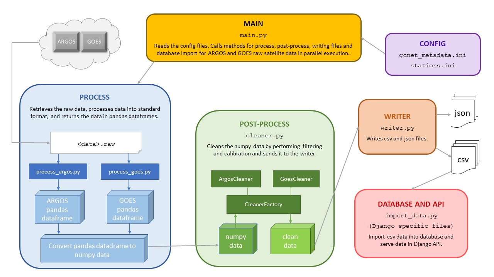

GC-Net Data Processing and API
===============================

Python software package that processes, filters and calibrate meteorological station data. Serves the data
in a dynamic Django API.

GC-Net (Greenland Climate Network) transmits data from several  meteorological stations via satellite.
They are equipped with communication satellite transmitters that enable near real-time monitoring of weather conditions on the
Greenland ice sheet. Data are periodically manually retrieved from station data loggers in Greenland.

The GC-Net API is a Django project that imports .dat and pre-processed csv files with meteorological
station data, processes and copies the data into a Postgres database, and serves the data
with a dynamic web API.

NOTE: This version is configured to use two databases to provide redundancy in the event of a
primary database server failure.

-------------------------------------
In Honor of Prof. Dr. Konrad Steffen
-------------------------------------

Prof. Dr. Konrad Steffen was the principal investigator of GC-Net and tragically died during a research expedition
in Greenland on August 8, 2020 in an accident.
His dedication made GC-Net possible and he encouraged the developers of this API to ensure
that the application was robust to guarantee access to the meteorological data.
Prof. Dr. Steffen was a committed scientist and generous friend and is deeply missed.

----------------------
Important Information
----------------------

This version assumes that there are two deployed instances of the project and two databases. There is a
primary instance and a backup instance. Each instance independently writes new data into its database.
This allows the project to be "bulletproof" so that if the primary database is down the backup database
can be read.

Most of the steps in this documentation should be duplicated (one for the primary instance and one for the
secondary instance.) The exception is the database setup and .env file configuration.

WARNING: gcnet/settings.py LINE 32 DEBUG setting should be False for security reasons before production deployment.
Leaving this setting at True is only ok during testing and development.

------------
Installation
------------

This software requires Python 3.8 and Django, it was developed using PyCharm IDE.

To install gcnet-backend follow these steps:

1. Clone the gcnet-backend repo from Github::

    https://github.com/EnviDat/gcnet-backend.git

2. It is recommended to create a virtual environment for this project.

   For example::

    python -m venv <path/to/project/<venv-name>

3. Activate new virtual environment::

    On macOS and Linux:
    source <venv_name>/bin/activate

    On Windows:
    .\<venv_name>\Scripts\activate

4. Install the dependencies into your virtual environment::

     pip install -r requirements.txt

5. Verify dependencies are installed correctly by running::

    pip list --local

----------------------
Configuration
----------------------

- **gcnet_metadata.ini**: This configuration file contains the general application execution parameters such as *newloadflag, short_term_days, etc*.

  * The paths can be expressed with linux-style slashes also for Windows, the software will translate them into the proper format for the current OS. Both absolute and relative paths are accepted.
  * The [file] section is usually the ONLY that may need to be edited to run this application, in particular the parameters *json_fileloc* and *csv_fileloc* should be set to existing paths in the system.
  * The [goes] and [argos] sections contain the parameters related to the raw data files retrieval and processing. The raw data processors can only be executed in Windows systems, to make tests in Unix or OSX environments you willl need to provide the corresponding .dat files (see commandline parameters in the section "Continuous Data Processing and Import")
  * The [columns] section specifies the data columns

All station-specific information and parameters should be defined in stations.ini:

- **stations.ini**: This file contains the calibration parameters such as *swmax, swmin, rhmin, etc*.

  * The [DEFAULT] section contains the base parameters that can be overwritten in the next sections that correspond to single stations.
  * The *no_data* value that will replace the values in the data that are missing or out of the bounds defined by the calibration parameters.
  * To change a calibration parameter it is only necessary to edit this file and restart the backend without editing the code.
  * **Note**: the *active* parameter in the default section should be set to true in the production environment to ensure the data all stations will be processed.

**[DEFAULT]**

Be sure to modify as needed the directory and/or URL with the input data in stations.ini::

    csv_data_dir = path/to/input/csv/files
    csv_data_url = https://www.wsl.ch/gcnet/data

    max and min values can be changed for each parameter if using management/commands/importcommand.py .dat file
    validator and logging

**[<STATION ID NUMBER>]**

Each station has its own section in stations.ini

Stations can be added and removed from stations.ini. However, stations must also be added or removed from
gcnet/models.py and migrations must be run on the database (see section "Create/Modify Database").

Example station configuration::

    name = GC-NET GOES station Swiss Camp 10m
    station_num = 00
    active = True
    position = latlon (69.5647, 49.3308, 1176)
    type = goes
    swin = 200
    swout = 200
    swnet_pos = 80
    swnet_neg = 80
    pressure_offset = 400
    csv_temporary = 00_swisscamp_10m
    csv_input = 0_v.csv
    model = swisscamp_10m_tower_00d
    api = True

Station configuration explanation::

    name = <station name>
    station_num = <station number>
    active = <if station is currently active>
    position = <latitude and longitude coordinates of station>
    type = <argos or goes> (this is the type of satellite transmission)
    swin = <specific calibration for station>
    swout = <specific calibration for station>
    swnet_pos = <specific calibration for station>
    swnet_neg = <specific calibration for station>
    pressure_offset = <specific calibration for station>
    csv_temporary = <first part of name of temporary csv file used in management/commands/csv_import.py>
    csv_input = <input csv file>
    model = <model to import data into, must match name of model used in gcnet/models.py>
    api = <True> (should be used in API) or <False> (should not be used in API)

--------------------
.env Configuration
--------------------

A .env file must be added to the gcnet directory so that that database and NGINX server operate securely and correctly.
gcnet/settings.py reads the values from this .env file. This project was developed using a Postgres database.
If using a local Postgres database the port number will probably be 5432.

**Primary Instance**

1. Create a .env file at gcnet/.env and enter your secret key and database settings ("db" means database).
The secondary database should use the database settings in the backup instance::

    SECRET_KEY=<secret key>

    DATABASE_NAME=<db_name>
    DATABASE_USER=<db_user>
    DATABASE_PASSWORD=<db_password>
    DATABASE_HOST=<localhost or IP address of server where DB is hosted>
    DATABASE_PORT=<5432 or whichever port is assigned to DB>

    DB_SECONDARY_NAME=<db_name_backup>
    DB_SECONDARY_USER=<db_name_backup>
    DB_SECONDARY_PASSWORD=<db_name_backup>
    DB_SECONDARY_HOST=<localhost or IP address of server where backup DB is hosted>
    DB_SECONDARY_PORT=<5432 or whichever port is assigned to backup DB>

**Backup Instance**

1. Create a .env file at gcnet/.env and enter your secret key and database settings
(db means database). This file is similar to the .env file in the primary database except the settings for
the two databases must be switched! The first set of database settings should correspond with the backup
database settings. The secondary database should use the database settings in the primary instance::

    SECRET_KEY=<secret key>

    DATABASE_NAME=<db_name_backup>
    DATABASE_USER=<db_name_backup>
    DATABASE_PASSWORD=<db_name_backup>
    DATABASE_HOST=<localhost or IP address of server where DB is hosted>
    DATABASE_PORT=<port number that is assigned to DB>

    DB_SECONDARY_NAME=<db_name>
    DB_SECONDARY_USER=<db_user>
    DB_SECONDARY_PASSWORD=<db_password>
    DB_SECONDARY_HOST=<localhost or IP address of server where primary DB is hosted>
    DB_SECONDARY_PORT=<port number that is assigned to primary DB>

-----------------------
Create/Modify Database
-----------------------

Before creating a database stations may be added or removed in gcnet/models.py.
Each station "model" is written as a child class that inherits its fields from the Station parent class.
Each model is a separate table in the Postgres database. The test model may be used for testing data imports and API calls.

1. Navigate to project directory in terminal and run::

    python manage.py makemigrations gcnet

    python manage.py migrate gcnet

2. Open database using PG Admin on local machine or server and verify that the tables in gcnet/models.py migrated correctly.

3. It is possible to add or remove models after the initial database setup. First add new station or remove existing station information from
gcnet/config/stations.ini

4. Add or remove models from models.py and then rerun the commands listed in number 1 of this section.
This project assumes that any new stations will inherit fields from the "Station" parent class. The source data
for the new station must use one the field structures listed in dat_import.py or csv_import.py

Example new station model in models.py::

    # New Station
    class new_station(Station):
        pass

--------------------
Data Import Commands
--------------------

After creating Postgres database there are several options for importing data into the GC-Net Django Postgres database
using the commands in the gcnet/management/commands directory. Continuous data imports are documented in the
section "Continuous Data Processing and Import".

During data imports values that were assigned in the source files as errors or missing  are converted to null

    The erroneous values are: '999', '999.0', '999.00', '999.000', '999.0000', '-999', NaN'

WARNING: Always make sure that the input source data file and model used in an import command are for the same station,
otherwise data could be imported into the wrong table.

**Import .dat files with logging and .dat file data validator**

NOTE: This import command does not check for existing records and should only be used during the initial database setup.
Attempting to import records that have identical timestamps will result in unique constraint errors.

The script for this command is importcommand.py

1. To import .dat files with logging first create a file called import.log in the gcnet/logs directory.

2. Navigate to project directory in terminal and run import command. For example::

        python manage.py importcommand -s 01_swisscamp -c config/stations.ini -i gcnet/data/01c.dat -d gcnet/data -m swisscamp_01d

        Be sure the input file is in the gcnet/data directory, otherwise change the argument accordingly.

        Arguments description from parser:

        parser.add_argument(
            '-s',
            '--station',
            required=True,
            help='Station number and name, for example "02_crawford"'
        )

        parser.add_argument(
            '-c',
            '--config',
            required=True,
            help='Path to stations config file'
        )

        parser.add_argument(
            '-i',
            '--inputfile',
            required=True,
            help='Path to input file'
        )

        parser.add_argument(
            '-d',
            '--directory',
            required=True,
            help='Path to directory which will contain intermediate cleaned csv file'
        )

        parser.add_argument(
            '-m',
            '--model',
            required=True,
            help='Django Model to map data import to'
        )

**Import .dat files without logging**

The script for this command is dat_import.py

This command only imports records that do not have an existing identical timestamp in the database.

To initially test .dat data import you can use the test data file "01c_test.dat" in the "test" directory.
The data can be imported into the "test" table of the database::

    python manage.py dat_import -s 01_swisscamp -c config/stations.ini -i test/01c_test.dat -d gcnet/data -m test

    Then open the "test" table to verify the data imported correctly.

1. To import .dat files without logging or validation navigate to project directory in terminal. Example command::

    python manage.py dat_import -s 01_swisscamp -c config/stations.ini -i gcnet/data/01c.dat -d gcnet/data -m swisscamp_01d

    Be sure the input file is in the gcnet/data directory, otherwise change the argument accordingly.

    The arguments used in dat_import.py are identical to the arguments used in importcommand.py (see description above).

2. To run several dat_import commands edit the first line in batch/dat_import.bat to the path of your project directory.
Be sure that the .dat files are in gcnet/data. Otherwise modify the inputfile arguments accordingly.
Then open a file explorer window and navigate to the project's batch directory, double click on dat_import.bat to execute.

**Import csv files**

The script for this command is csv_import.py

This command only imports records that do not have an existing identical timestamp in the database.

To implement logging create csv_import.log in gcnet/logs and uncomment out these lines in csv_import.py::

    # dat_validator(kwargs['config'], row, kwargs['inputfile'])

    # logger.info('{0} successfully imported, {1} new record(s) written in {2}'.format((kwargs['inputfile']),
    #                                                                                  records_written,
    #                                                                                  (kwargs['model'])))

To initially test csv data import you can use the test data file "1_v_test.csv" in the "test" directory.
The data can be imported into the "test" table of the database::

    directory:
    python manage.py csv_import -s 01_swisscamp -c config/stations.ini -i test/1_v_test.csv -d gcnet/data -m test -t directory

    Then open the "test" table to verify the data imported correctly.

1. To import csv files navigate to project directory in terminal. There are two valid (-t) typesource arguments:
"directory" (file path for (-i) inputfile argument) and "web" (URL for (-i) inputfile argument).

Example commands::

    directory:
    python manage.py csv_import -s 00_swisscamp_10m -c config/stations.ini -i gcnet/data/0.csv -d gcnet/data -m swisscamp_10m_tower_00d -t directory
    (Verify the input file is in the gcnet/data directory, otherwise change the argument accordingly.)

    web:
    python manage.py csv_import -s 23_neem -c config/stations.ini -i https://www.wsl.ch/gcnet/data/23_v.csv -d gcnet/data -m neem_23d -t web

    The arguments used in csv_import.py are almost identical to the arguments used in importcommand.py (see description above)
    except for an additional "typesource" argument:

    parser.add_argument(
            '-t',
            '--typesource',
            required=True,
            help='Type of data source. Valid options are a file path: "directory" or a url: "web"'
        )

2. There are two batch files to run several csv_import commands.

    inputfile in directory: Edit the first line in batch/csv_import_directory.bat to the path of your project directory.
    Be sure that the csv files are in gcnet/data. Otherwise modify the inputfile (-i) arguments accordingly.
    Then open a file explorer window and navigate to the project's batch directory, double click on csv_import_directory.bat to execute.

    inputfile on web: edit the first line in batch/csv_import_web.bat to the path of your project directory.
    Be sure that the csv files are served at https://www.wsl.ch/gcnet/data. Otherwise modify the inputfile (-i) arguments accordingly.
    Then open a file explorer window and navigate to the project's batch directory, double click on csv_import_web.bat to execute.

--------------------------------------
Continuous Data Processing and Import
--------------------------------------

To continuously import data run main.py

main.py has three arguments::

    -r (--repeatInterval) This runs the the import every <interval> minutes

    -i (--inputType) Input data source read from stations.ini config. This is a required argument.
            Options:
                "path" = directory path (csv_data_dir in stations.ini)
                "url" = URL address hosting files (csv_data_url in stations.ini)

    -l (--localFolder) Load local .dat files from folder and skip processing

Open terminal and navigate to project directory. During testing this script only worked when the virtual environment
was not activated.

Run python and import main::

    python
    import gcnet.main

Then run main.py

Example commands running every 15 minutes::

    Import data from URL:         gcnet.main.main(['-r 15', '-i url'])
    Import data from directory:   gcnet.main.main(['-r 15', '-i path'])

- **-l <folder>**: For Unix and OSX environments, you can use this option to provide locally stored dat files that should be present in the designated folder with the exact names *argos_decoded.dat* or *goes_decoded.dat*. For example if you place the input dat files in a subfolder called *input* in the project root directory the command should be::

     gcnet.main.main(['-r 15', '-i url', '-l input'])

----------------------
Development Server
----------------------

Django has an inbuilt development server.
This server should only be used during development and testing and not for production.

1. Navigate to project directory in terminal. Make sure virtual environment created earlier
with Django and other dependencies is activated. Run::

    python manage.py runserver

2. By default the development server is hosted at http://localhost:8000/

    To test if the server is working properly browse to a valid API URL: http://localhost:8000/api/models/

    A list of station values by the 'model' keys in the config/stations.ini file should be returned.

    An overview of the API is in the section "API" and in greater detail in "API-Documentation.html".

    Example valid API calls to "test" table database::

        Data from the 1_v_test.csv import:
            http://localhost:8000/api/dynamic/test/all/windspeed1/2020-07-27T00:00:00/2020-07-28T00:00:00/
            http://localhost:8000/api/dynamic/test/quarterday/airtemp1/2020-07-27T00:00:00/2020-07-28T00:00:00/

        Data from the 01c_test.dat import:
            http://localhost:8000/api/dynamic/test/halfday/netrad/1996-01-01T00:00:00/1996-01-02T00:00:00/
            http://localhost:8000/api/dynamic/test/all/airtemp2/1996-01-01T00:00:00/1996-01-02T00:00:00/

    Other example valid API calls::

        http://localhost:8000/api/dynamic/east_grip_24d/all/windspeed1/1594227600/1596092400/

        http://localhost:8000/api/dynamic/swisscamp_01d/all/windspeed1/2020-07-08T17:00:00/2020-07-09T03:00:00/
        (do not include the "Z" at the end if an ISO timestamp in Zulu (UTC) time)

--------------------
NGINX Configuration
--------------------

Make sure you have installed NGINX on your machine. During development NGINX version 1.19.1 was
used. NGINX can be downloaded at http://nginx.org/en/download.html

A helpful guide can be found at (scroll to "NGINX and Waitress")
https://github.com/Johnnyboycurtis/webproject and accompanying tutorial video at
https://www.youtube.com/watch?v=BBKq6H9Rm5g

1. Edit ALLOWED_HOSTS in gcnet/settings.py if needed to include server domain name. For example::

    ALLOWED_HOSTS = ['localhost', 'wunderbar.server.ch']

2. Edit nginx_waitress/gcnet_nginx.conf::

    LINE 8: Edit the port number the site will be served on,
            it should not be the same port that the database uses in gcnet/.env

    LINE 11: Edit the server_name to your machine's IP address or FQDN

    LINES 23-25: If using static files uncomment these lines and put the path to your project's
        static folder in LINE 24

    LINE 29: Edit proxy_pass if wanted to match the server running from Waitress (i.e. runserver.py, LINE 8).
        This will usually be localhost or your IP address.

3. Open runserver.py::

    LINE 8: Make sure that host and port are match the settings used in gcnet_nginx.conf

    For example, if you used localhost and port 60 in gcnet_nginx.conf like this:
        LINE 8:  listen      60;
        LINE 29: proxy_pass http://localhost:8060;

    Then runserver.py should have these settings:
        LINE 8:  serve(application, host = 'localhost', port='8060')

4. Create two directories inside of C:/nginx/ or wherever you downloaded nginx::

    Create directories:
        sites-enabled
        sites-available

    Copy gcnet_nginx.conf into the two directories

5. Edit C:/nginx/conf/nginx.conf (or wherever the nginx parent directory is stored on your machine)::

    Insert after line with "default_type  application/octet-stream;"
    (the syntax must have the exact gap between include and the path!):
    include         C:/nginx-1.19.1/sites-enabled/gcnet_nginx.conf;

    After line with " #gzip  on;" change the port in this section:

        server {
            listen       80;
            server_name  localhost;

    Change port from 80 to a non-essential port like 10, as 80 will be utilized for the Django project.

    For example:

        server {
            listen       10;
            server_name  localhost;

    Make sure to save changes to nginx.conf

6. Open a terminal at C:/nginx/ (or wherever the nginx parent directory is stored on your machine)
   and run this to check that the syntax of nginx.conf is correct::

    nginx.exe -t

    If the syntax of correct a message similar to this one will print:
        nginx: the configuration file C:\nginx-1.19.1/conf/nginx.conf syntax is ok
        nginx: configuration file C:\nginx-1.19.1/conf/nginx.conf test is successful

7. If everything is successful run this to start the server::

        nginx.exe

       To verify NGINX is running you can check Task Manager.

8. Next navigate to the project directory in a terminal. Make sure virtual environment created earlier
with Django and other dependencies is activated. Run the server::

    python runserver.py

9. Then open a web browser and navigate to::

    http://localhost (or the IP address or domain name used in the conf files)

    To test if the server is working properly browse to a valid API URL: http://<host>/api/models/
    A list of stations by the 'model' key in config/stations.ini file should be returned.

-----
API
-----

The API has separate documentation.

Open API-Documentation.html in a browser to view documentation.

Brief overview::

    Return list of stations by model
    GET   /api/models/

    Return dynamic data
    GET   /api/dynamic/{model}/{lod}/{parameter}/{start}/{end}/

    Return derived data
    GET   /api/derived/{model}/{lod}/{parameter}/{calc}/{start}/{end}/

    Example valid API call:
    http://<host>/api/dynamic/swisscamp_01d/all/windspeed1/2002-07-08T17:00:00/2002-07-09T03:00:00/

Parameters used in API call::

   {parameter}          NAME [UNITS]

   swin                 SW_down [W m-2]
   swout                SW_up [W m-2]
   netrad               Net Radiation F [W m-2]
   airtemp1             TC Air 1 G Air Temperature [degC]
   airtemp2             TC Air 2 H Air Temperature [degC]
   airtemp_cs500air1    CS500 T Air 1 I Air Temperature [degC]
   airtemp_cs500air2    CS500 T Air 2 J Air Temperature [degC]
   rh1                  RH 1 K Relative Humidity [%]
   rh2                  RH 2 L Relative Humidity
   windspeed1           U1 M Wind Speed [m/s]
   windspeed2           U2 N Wind Speed [m/s]
   winddir1             U Dir 1 O [deg]
   winddir2             U Dir 2 P [deg]
   pressure             Atmos Pressure Q [mbar]
   sh1                  Snow Height 1 R [m]
   sh2                  Snow Height 2 S [m]
   battvolt             Battery Voltage [V]
   swin_max             [W m-2]
   swout_max            [W m-2]
   netrad_max           NetRadMax[W m-2]
   airtemp1_max         Max Air Temperature1 (TC) [degC]
   airtemp2_max         Max Air Temperature2 (TC)[degC]
   airtemp1_min         Min Air Temperature1 (TC)[degC]
   airtemp2_min         Min Air Temperature2 (TC) [degC]
   windspeed_u1_max     Max Windspeed-U1 [m/s]
   windspeed_u2_max     Max Windspeed-U2 [m/s]
   windspeed_u1_stdev   StdDev Windspeed-U1 [m/s]
   windspeed_u2_stdev   StdDev Windspeed-U2 [m/s]
   reftemp              Ref Temperature [degC]

